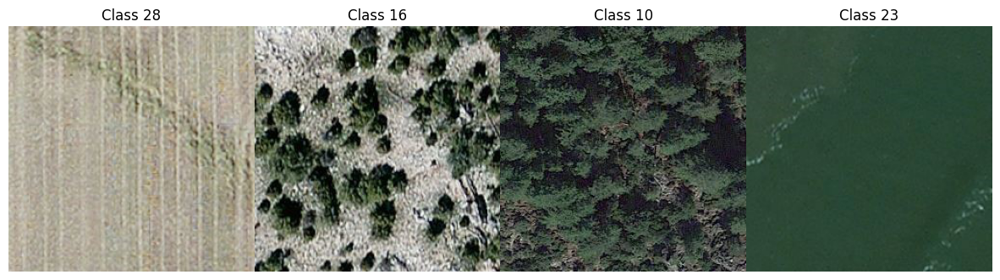
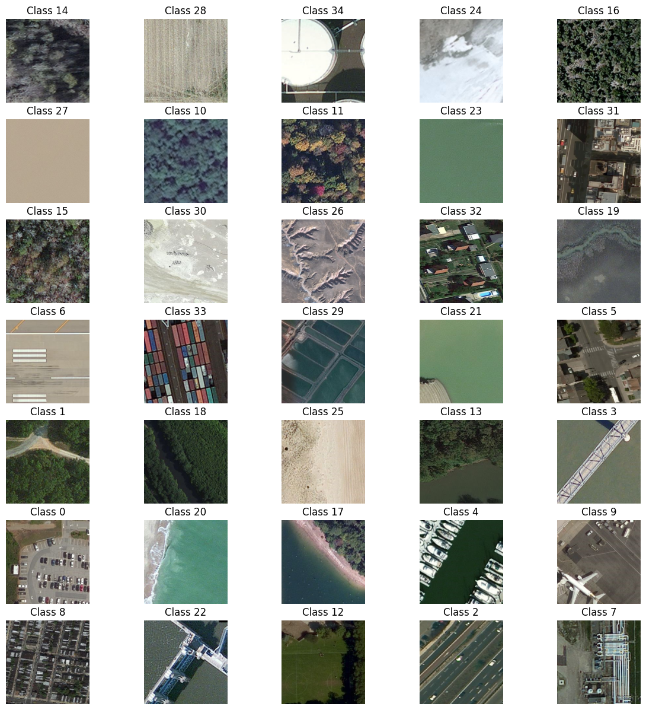
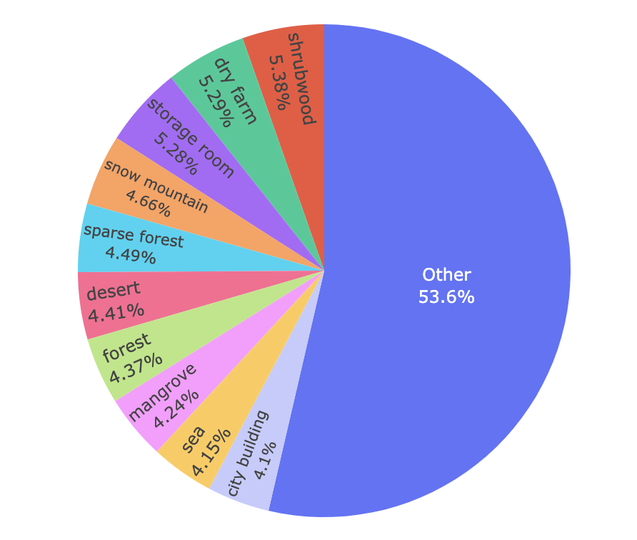

# 🛰 SatelliteVision-CNN-PyTorch

This repository implements a **Convolutional Neural Network (CNN)** for satellite image classification using **PyTorch**. The project focuses on distinguishing visually similar satellite images from different land use/land cover classes, offering a **realistic classification challenge**.

## Key Features
- **Custom CNN Model**: Achieved **98% accuracy** after 10 epochs.
- **Pretrained ResNet50**: Reached **100% accuracy** after 2 epochs.
- **Efficient Dataset Handling**: Dataset loading, transformation, and filtering to target specific classes.

---

## Dataset Overview

The dataset, sourced from [Hugging Face](https://huggingface.co/datasets/jonathan-roberts1/RSI-CB256/viewer/default/train?f[label_2][value]=28), contains **24,747 satellite images** spread across **35 classes** and weighs **4.2 GB** in size. Some of the notable classes include:
- Parking lots
- Highways
- Forests
- Seas
- City buildings
- Etc.

### Dataset Visualization

After **Exploratory Data Analysis (EDA)**, we selected a subset of **4 classes** to create a **realistic classification task**. Below are the visualizations for both the target classes and the original dataset with all 35 classes.

#### Target Classes (Post-EDA):


#### Original Dataset (35 Classes):


---

## Problem Definition

To create a **realistic challenge**, we selected classes with overlapping visual features, such as:
- **Dry farm** (Class 28): Yellow-dominant.
- **Sparse forest** (Class 16): Yellow-green mix.
- **Forest** (Class 10): Predominantly green.
- **Sea** (Class 23): Various shades of green.

These classes share similarities in both color and shape, requiring the model to make fine distinctions.

### Dataset Distribution with Threshold (1000 Images):


---

## Model Performance

| Model             | Accuracy    | Epochs  |
|-------------------|-------------|---------|
| Custom CNN        | 98%         | 10      |
| Pretrained ResNet50 | 100%       | 10      |

Both models performed well in this **realistic classification task**, with the fine-tuned ResNet50 achieving perfect accuracy by the 10th epoch.

---

## Running the Code

To train and evaluate the model, run the following commands:

```bash
python train.py
